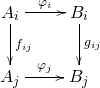
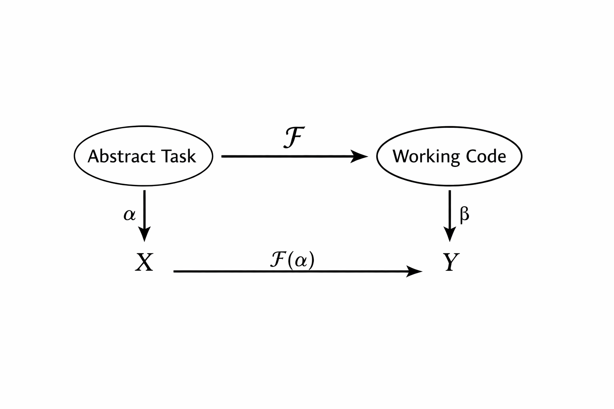

# Automation Engineering

Take a process and reduce human interaction.

---

# What is a process?

$$\mathtt{process} : \mathtt{input} \rightarrow \mathtt{output}$$

---

# What is $\mathtt{input}$?

## Numbers

| Type         | Name     | Values |
|:-:|:-|:----:|
| $\mathbb{N}$ | Natural  | $\lbrace 0, 1, 2, 3, 4, 5 \ldots \rbrace$ |
| $\mathbb{Z}$ | Integer  | $\lbrace \ldots, -1, -2, 0, 1, 2, \ldots \rbrace$ |
| $\mathbb{Q}$ | Rational | $\lbrace \ldots, \frac{4}{3}, \frac{42}{1}, \frac{314159}{10^5}, \ldots \rbrace$ |
| $\mathbb{R}$ | Real     | $\lbrace \ldots, \pi, e, \phi, \ldots \rbrace$ |

$\mathbb{N} \subset \mathbb{Z} \subset \mathbb{Q} \subset \mathbb{R}$

---

## Text

- "ChatGPT, please help me do my homework!"

- "3b8693418a2e017521e7b7179378980d"

- "Íthglir tiriel i vîr sílaí"

Sometimes denoted as $\Sigma$


## Logic

- `True` | `False`

- $a \land b \lor \neg c$


---

## Tuples

$\lparen \Sigma, \mathbb{Q} \rparen$

Example value: ("Alex", 32.8)

## Cases

Animal = Mammal | Insect | Fish | Amphibian | Reptile | Dinosaur

Toy = Gizmo | Gadget | Doohicky

Christmas = Present Toy | Coal

$\mathbb{N}^{+} = Finite \quad \mathbb{N} \quad | \quad Infinity$

Examples:

`Dinosaur : Animal`

`Present Gizmo : Christmas`

`Finite 42 : `$\mathbb{N}^{+}$

---

# What is $\mathtt{output}$?

***The same as inputs!***

*(Remember this)*

---


# If $\mathtt{output}$ can be an $\mathtt{input} \ldots$


$$\mathtt{process_0} : \mathtt{input_0} \rightarrow \mathtt{output_0}$$

$$\mathtt{process_1} : \mathtt{input_1} \rightarrow \mathtt{output_1}$$

When $\mathtt{output_0} = \mathtt{input_1}$

$$ \mathtt{process_1} \circ \mathtt{process_0} $$

---

# If $\mathtt{output}$ can be an $\mathtt{input} \ldots$


$$\mathtt{grind\_flour} : \mathtt{grain} \rightarrow \mathtt{meal}$$

$$\mathtt{sieve\_flour} : \mathtt{meal} \rightarrow \mathtt{flour}$$

Since $\mathtt{meal} = \mathtt{meal}$

$$ \mathtt{create\_flour} = \mathtt{sieve\_flour} \circ \mathtt{grind\_flour} $$

---

# Oops, you already learned category theory!




---

## Composition

$$f : a \rightarrow b$$
$$g : b \rightarrow c$$
$$h : a \rightarrow c$$
$$h = g \circ f$$

---

# But what about more parameters?

## Currying

1. $f : a \rightarrow \; b \rightarrow c \;$
2. $f : a \rightarrow \lparen b \rightarrow c \rparen$
    - $p : b \rightarrow c$
3. $f : a \rightarrow p$


*Functions can return other functions!*

---

## Partial Application

```
midpoint : Rational -> Rational -> Rational
midpoint x y  = min x y + (max x y - min x y) / 2
```

Evaluated:
```
<<< midpoint 56.3 58.5
>>> 57.4
```

---

```
midpoint : Rational -> Rational -> Rational
midpoint x y  = min x y + (max x y - min x y) / 2
```

**Types:**

| Function | Type |
|:---|:--|
| `midpoint` | $\mathbb{Q} \rightarrow \mathbb{Q} \rightarrow \mathbb{Q}$ |
| `midpoint 56.3`  |$\mathbb{Q} \rightarrow \mathbb{Q}$ |
| `midpoint 56.3 58.5` | $\mathbb{Q}$ |

---

```
midpoint : Rational -> Rational -> Rational
midpoint x y  = min x y + (max x y - min x y) / 2
```

**Values**

1. `midpoint`
    - `x y -> min x  y  + (max x  y  - min x  y ) / 2`
2. `midpoint 56`
    - `. y -> min 56 y  + (max 56 y  - min 56 y ) / 2`
3. `midpoint 56 58`
    - `.      min 56 58 + (max 56 58 - min 56 58) / 2`


---

# If functions can output other functions...

*Functions can take functions as inputs!*

```
Ordering = Less | Same | More
```

$\mathtt{sort} : \lparen \mathbb{Q} \rightarrow \mathbb{Q} \rightarrow \mathtt{Ordering} \rparen \rightarrow \mathtt{List} \mathbb{Q} \rightarrow \mathtt{List} \mathbb{Q}$
```
sort compare empty = empty
sort compare [ x ] = [ x ]
sort compare xs = merge compare sortedL sortedR
  where
    sortedL = sort cmp left
    sortedR = sort cmp right
    (left, right) = split xs
```

---

## Processes are Functions

- Break you process down into small conceptual units

- Model the conceptual units as functions over inputs and outputs

- Define the types of your functions to track data

- Compose many functions together to make your process

---

## It is that simple

1. Decompose into many functions you can implement
2. Compose functions into working, automated process


